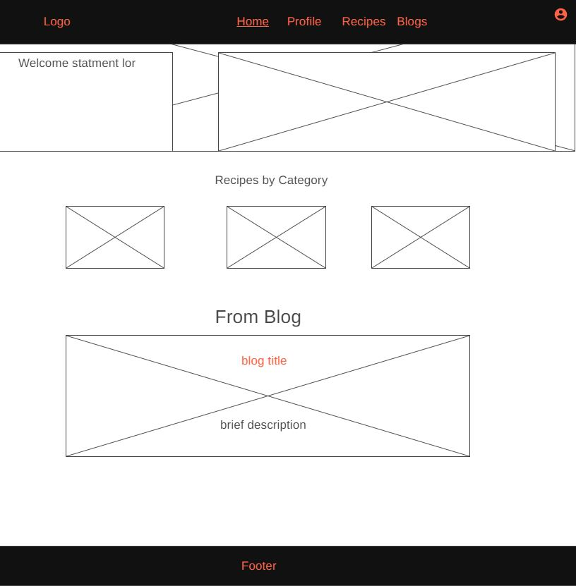

# Tasty
Contains our project during code 301 class as a part of our software development intensive courses at ASAC with partnership with Code Fellows (US, Seattle).
The project idea is to create a website that suggests recipes depends on ingredients available in your kitchen, it will also prints out the missing ingredients needed to cook the meal.

# Team Members
- Yousef Salem
- Mohammad Jaradat
- Mariam Odat
- Murad Al-Shorman
- Saad Jabali

# User Stories

1- attractive home page: as a user , I would like to see what kind of recipes the website include as well as the servecies that it provides. 

2- General layout: as a user I would like to see a good looking website with easy and flexible options and with clear instructions followed by every option if needed.

3- login authentication: As a user I need to have an account to use website features such as favorite recipes and posting blogs.

4-Categories: as a user I would like to see a well and simple designed page, a clear preview for recipes, and to navigate easily between categories.

5- Blog: as a user I would like to post a blog easily, and to see other people have posted with a clear and nice format.


# Wire Frames

## Home Page


## Profile Page


## Recipes Page


## Blogs Page


# Back-end Data Base Model

```
userModel{
	email: ""
	name:""
	myRecipes:[]
}

blogModel{
	title: ""
	text: ""
	userName:""
	Image:""
}
recipesModel{
	recipeName:""
	recipe:""
	calories:
	ingredients:	
}
```

